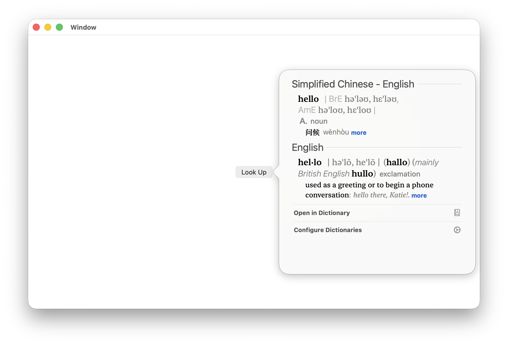
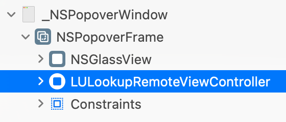
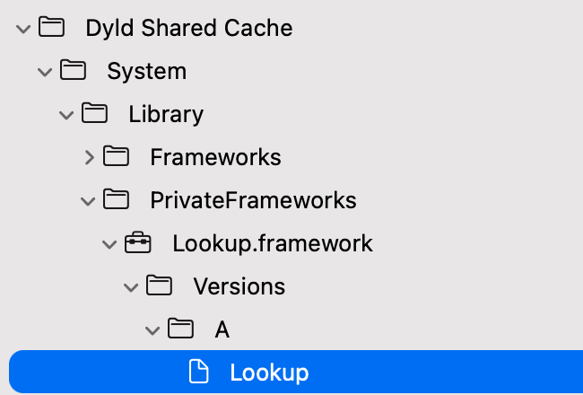
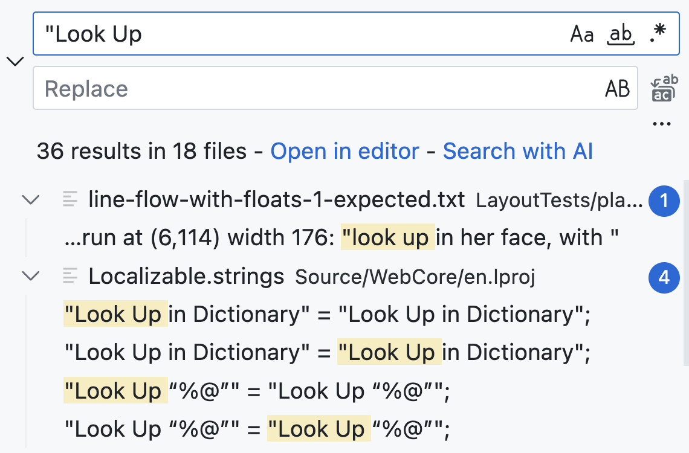
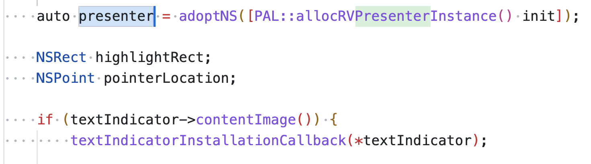
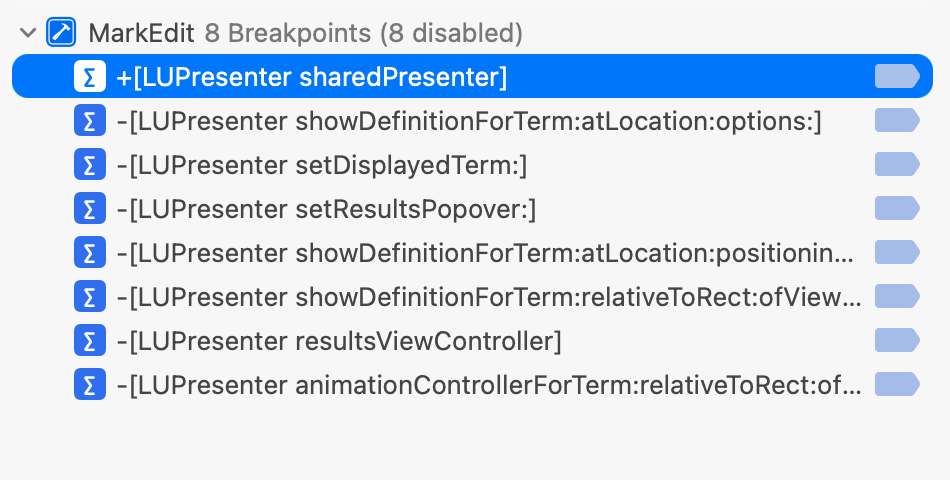

## Look Up

On a Mac with a trackpad, force-pressing a word in many native apps brings up **Look Up** — a polished popover that feels deeply integrated into the system.

Apple ships many features like this: beautifully designed, minimally customizable, and often inaccessible to third-party developers.

In my app **[TextGrabber2](https://github.com/TextGrabber2-app/TextGrabber2)**, I’ve been using a private framework, `TranslationUIServices`, to present a native-looking translation window. Apple also provides a public framework, [Translation](https://developer.apple.com/documentation/translation/), but it lacks the flexibility and fidelity of what Apple uses internally.

For a long time, I’ve been curious about how **Look Up** works — and more importantly, whether it can be triggered programmatically (without launching the Dictionary app).

This project documents how I uncovered that mechanism. The result lives here:
[ViewController.m](/LookUp/ViewController.m)

---

## How I Revealed It

My first attempt was straightforward: trigger the Look Up popover inside one of my apps and inspect it at runtime.

It didn’t take long to notice that the UI is hosted by a `LULookupRemoteViewController`. As expected, it’s implemented using Apple’s “remote view controller” architecture, with most of the UI details abstracted away.

To dig deeper, I turned to tools like [RuntimeBrowser](https://github.com/nst/RuntimeBrowser) and [RuntimeViewer](https://github.com/MxIris-Reverse-Engineering/RuntimeViewer). That’s when I found `LookUp.framework` — a private framework containing a large number of undocumented classes.

At this point, progress stalled. The framework surface area is huge, and without context it’s hard to know where to start. I eventually gave up and went back to playing games for a few days.

Then it clicked.

Safari also supports Look Up — and **WebKit is open source**.

I searched for “Look Up” in the WebKit codebase and immediately found a trail of relevant references.

Those led me to a component called `DictionaryLookup`. More importantly, I started seeing key concepts repeatedly: `presenter`, `animationController`, and related abstractions.

That rang a bell — `LUPresenter` exists in `LookUp.framework`.

From there, the approach became clear: **symbolic breakpoints**.

I added breakpoints to the suspected presenter and animation entry points, then triggered Look Up repeatedly to see which symbols were hit.

That experiment confirmed the call flow and revealed exactly which APIs are involved.

The distilled result is what you see in
[ViewController.m](/LookUp/ViewController.m).

---

## Final Thoughts

Why does this matter? Mostly because it’s fun. But also because this technique may be useful in real apps — just like my earlier use of `TranslationUIServices`.

Would I recommend this approach? No. Using private APIs violates App Store Review Guidelines. (TextGrabber2 is not a Mac App Store app.)

Still — understanding how the system actually works is half the joy.

Happy hacking!
